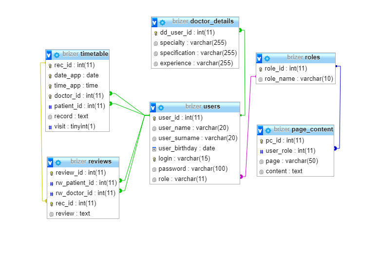

## Hospital System PoC
Hospital management system prototype implemented in Java using Spring Boot and JSP. 
The database is in the resources, as a dump. DB schema:

 
 
The system is frozen on 02/03/2021 to avoid outdating the date variable base in the TimeHolder class 
3 types of users are implemented:

### ADMIN
login:admin 
password:admin 
The ADMIN role is used for the receptionist, available functions: 
Register a new doctor. 
Create a schedule of doctors' work 
View the archive of records 
View patient reviews of doctors.

### DOCTOR
login:doctor 
password:doctor 
Роль DOCTOR используется для работы врача: 
Opening an appointment and making a record of it, for today. Or marking a patient as absent 
Viewing your appointment archive 
Viewing future patient records

### PATIENT
login:patient 
password:patient 
The PATIENT role is used for visitors, available functions: 
Make an appointment with a doctor 
View your future appointments 
Cancel an appointment with a doctor 
Leave a feedback of a recent appointment   
#### Warning: the project was designed only for Google Chrome, correct work in another browser is not guaranteed
